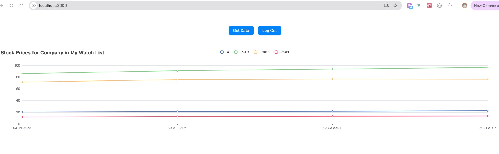

# DayTrade Framework 📈

A full-stack day trading framework for experimenting with stock market strategies in a modular, scalable, and UI-driven environment. Built with Express, TypeScript, React, and ECharts.

---

## 🗂 Project Structure

```
daytrade-framework/
├── backend-project/    # Express backend with session-based auth and route decorators
└── frontend-project/   # React frontend with Ant Design and ECharts
```

---

## 🔧 Features

- ✅ Session-based login/logout
- 📊 Fetch and display stock price data over time
- 📈 ECharts-powered data visualization
- 🔐 Route protection via custom middleware
- 💡 Uses decorators for clean controller structure (inspired by NestJS)

---

## 📸 Screenshots


---

## ⚙️ Tech Stack
**Frontend**: React, TypeScript, React Router, Ant Design, ECharts

**Backend**: Express, TypeScript, reflect-metadata, cookie-session

**Dev Tools**: ts-node, nodemon, concurrently

---

## 🚀 Getting Started

### 1. Clone the repo

```bash
git clone https://github.com/Shaobangzhu/daytrade-framework.git
cd daytrade-framework
```

### 2. Setup Backend

```bash
cd backend-project
npm install
npm run start
```

- Runs at: `http://localhost:7001`
- Available Endpoints:
  - `POST /api/login`
  - `GET /api/logout`
  - `GET /api/isLogin`
  - `GET /api/getData`
  - `GET /api/showData`

### 3. Setup Frontend

```bash
cd backend-project
npm install
npm run start
```

- Runs at: `http://localhost:3000`
- Pages:
  - `/login` — Login form
  - `/` — Home page with chart and data actions

---

## 📁 Data File
Stock data is saved to:
backend-project/data/prices.json

use Node.js’s path module to resolve the path dynamically:

```bash
import path from 'path';

const filePath = path.resolve(__dirname, '../data/prices.json');

```
This approach works safely across:
- ✅ Windows
- ✅ macOS
- ✅ Linux
- ✅ Varying directory structures

---

## 📌 TODO
- [ ] Add user registration
- [ ] Save user watchlists
- [ ] Store data in a NoSQL database (e.g., MongoDB)
- [ ] Implement trading strategy editor


---

## 📝 License
This project is licensed under the [MIT License](LICENSE).

---

> ⚠️ **Disclaimer**: This is a personal project for educational purposes. It is not intended for real-world trading use without further validation, error handling, and security.